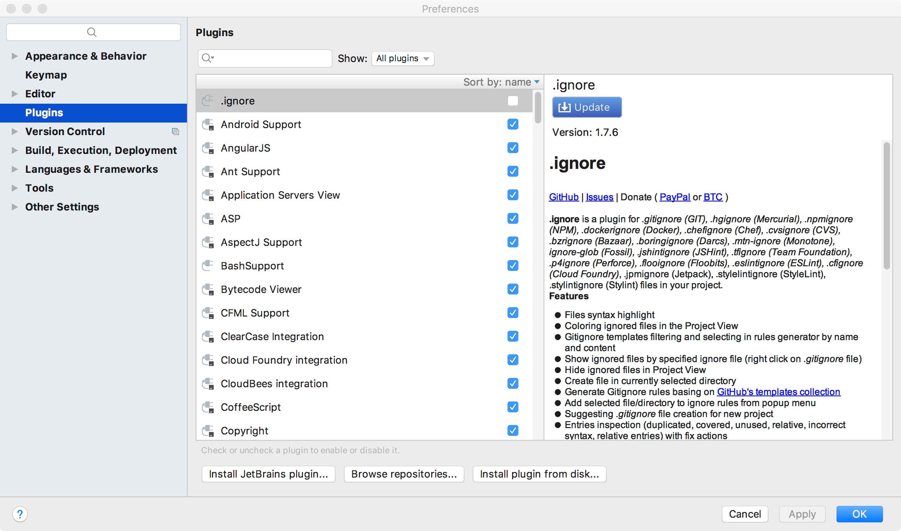
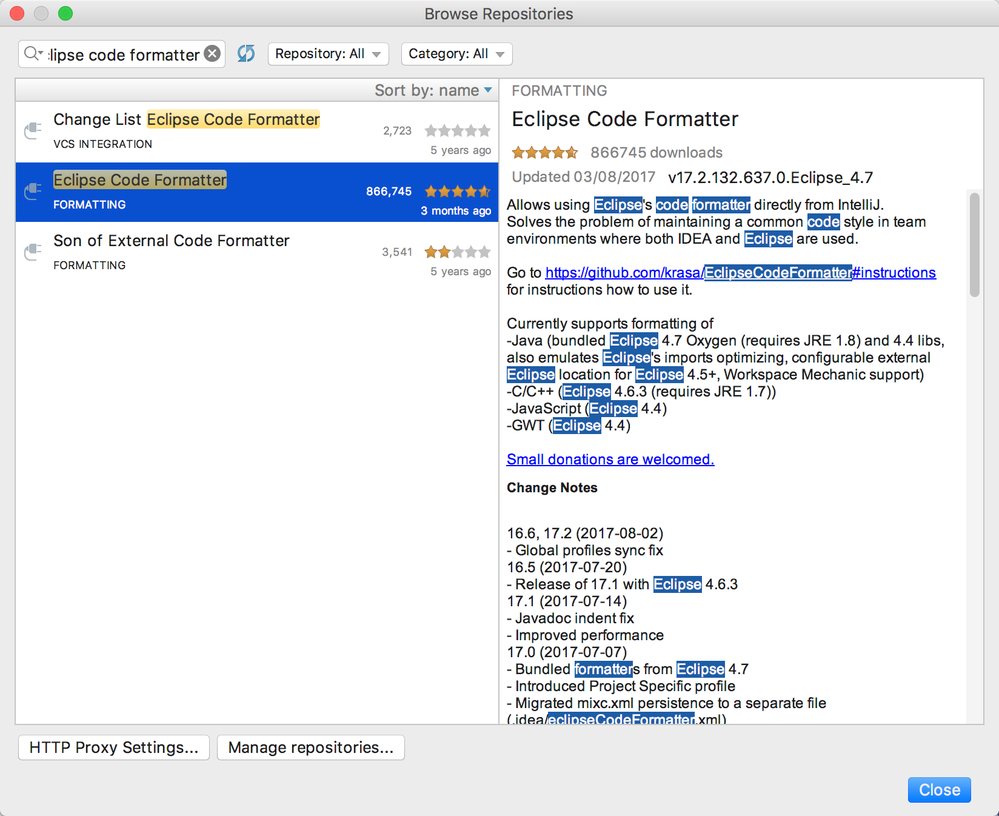
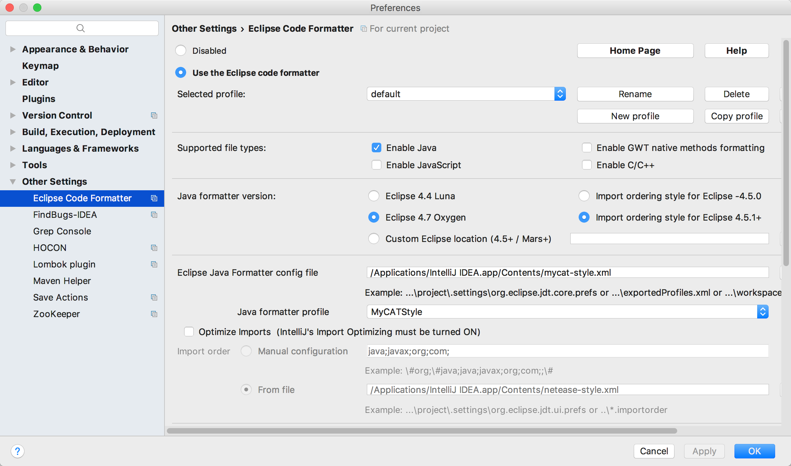

# Welcome to MyKingdom

## 初次使用指南
### 一、 模版导入
MyKingdom使用模版在项目包的template目录下，使用的模版文件名为mycat-style.xml。  

具体配置参考：
#### Intellij IDEA
1. 打开IDEA的 Preferences -> Plugins  
    

  ​

2. 在最下方选择 Browse repositories，搜索"Eclipse Code Formatter"，在右侧选择安装 install  
    

  ​

3. 打开IDEA的 Preferences -> Other Settings -> Eclipse Code Formatter，开启格式化 "Use the Eclipse code formatter"

  在 Eclipse Java Formatter config file 中将格式化文件导入，文件在项目的 doc/templates 路径下，文件名为mycat-style.xml  

  ​

#### Eclipse

1. 打开 Eclipse 的 Preferences -> Java -> Code Style -> Formatter  
    

  ​

2. 点击 Import 将 mycat-style.xml 加入进 profile 中  
    

  ​

3. 在 Active profile 的下拉列表中选择 MyCATStyle  
    

  ​

### 二、 保存自动格式化（可选）

#### Intellij IDEA
1. IDEA的自动保存格式化需要添加 plugin，在 Preferences -> Plugins 中输入 Save Actions，在右侧框框中点击安装  
    

  ​

2. 在 Preferences -> Other Settings 中选择 Save Actions 配置自动保存时的操作
    

  ​

#### Eclipse

在 Eclipse 的 Preferences -> Java -> Editor -> Save Action 中勾选自动保存时的行为，如下所示，并点击Apply、OK  
  

至此配置完毕，在写完代码保存之后即可完成格式化。