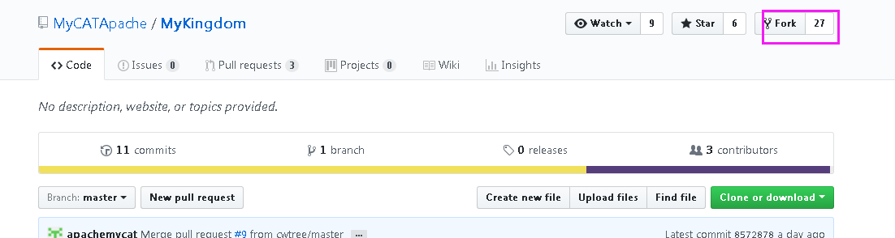
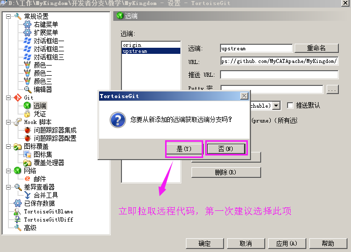
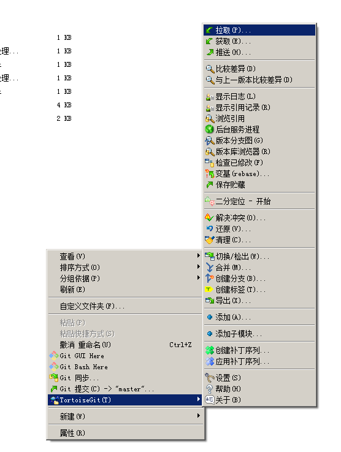

# 目录
* [一、Fork项目到自己的github账号](#一、Fork项目到自己的github账号)
* [二、安装客户端工具](#二、安装客户端工具)
* [三、检出项目](#三：检出项目)
* [四、提交代码及合并代码流程](#四、提交代码及合并代码流程)
* [五、提交代码到自己的Fork](#五、提交代码到自己的Fork)
* [六、官方Merge请求](#六、官方Merge请求)
* [七、从官网源同步代码](#七、从官网源同步代码)

# 一、Fork项目到自己的github账号

#### 1. 点击fork到自己的账号下

#### 2. 查看自己fork项目地址，假如你的用户名my，则项目地址：[https://github.com/my/MyKingdom](https://github.com/my/MyKingdom)

# 二、安装客户端工具

按顺序安装

- Git
- TotoiseGit
- TortoiseGit-LanguagePack-CN（中文语言包，可选择安装）

# 三、检出项目
#### 1. 文件右键菜单：Git 克隆（Git Clone）

#### 3. 填入“自己Fork的地址”，注意不是官方的项目地址！

#### 4. 增加官方源地址:upstream

#### 5. 打开本地目录，右键TotoiseGit――》设置（Settings）

#### 6. 输入upstream的地址，注意这里是官方的项目地址，点击保存。原来的origin则是你Fork的地址，保持不变。

#### 7. 保存的时候，第一次会提示，为了防止出错，关闭默认从该地址pull/fetch的功能，我们要点击"否（No）"，即默认从官方源pull/fetch，以同步到我们的本地库中。

#### 8. 接下来会从upstream拉取一次源码：

#### 9. 如果刚刚设置不小心选择了“否”，也可以手动拉取，操作：

# 四、提交代码及合并代码流程

如果我们本地有代码改变，比如新增文件或代码，流程如下：

Commit（本地提交）-> push（提交到自己Fork的地址）-> 发起pull request(可以工具里或者gihub自己的项目主页里) -> 官方审核我们的提交 -> 重新从官方拉取最新代码

# 五、提交代码到自己的Fork

#### 1. 比如我们新增了一个文件，右键TotoiseGit �C》添加（Add），添加到版本控制文件列表中，然后提交（Commit）到本地库里。

#### 2.Commit完成以后可以继续Push，或者以后Push，只有Push到自己Fork地址以后，才是提交到github里了，否则只是本地保存了。

输入自己的用户名密码提交

注意到，目标地址Remoet为Origin地址，即我们自己Fork的地址。

#### 3. Push成功以后，显示如下内容，可以继续发起pull reqest请求，将变更提交到官方源地址(upstream)，请求合并你的变更：

# 六、官方Merge请求

所有的Pull request会在官方项目信息里看到，如果没有冲突，则官方会选择合并。
官方也可能会拒绝，拒绝的话，组好提供详细的拒绝理由，供请求者参考和改进，重新发起Pull。
如果无法自动合并，则表明冲突了，需要发起者同步一次官网最新代码并且Merge以后再提交。

# 七、从官网源同步代码

可以用拉取（pull）或者获取（fetch）两种方式从官网源（upstream）同步代码，获取（fetch）是执行了拉取（pull）+ 合并（merge）的操作，即拉取（pull）下来与本地的仓库进行合并（merge）操作，建议百度更详细的说明。

  